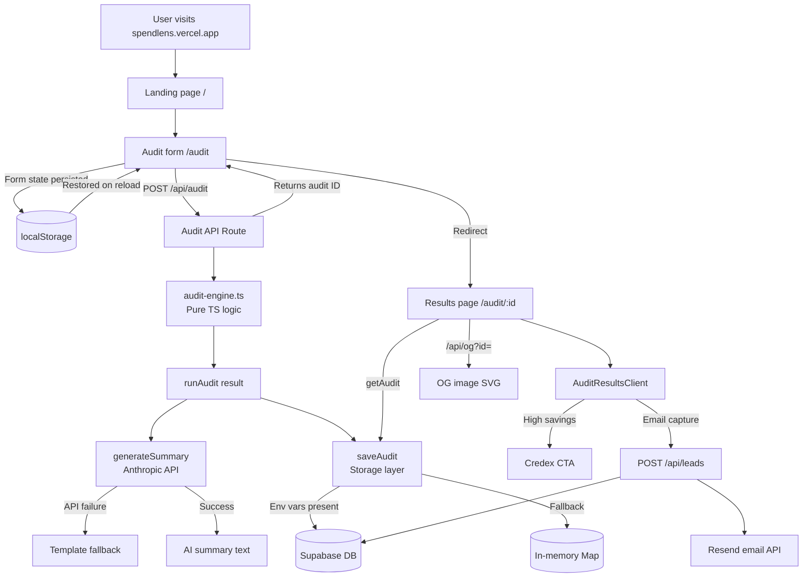

# Architecture

## System Diagram

## Data Flow: Input → Audit Result

1. **User fills form** (`/audit`) — picks tools, plans, monthly spend, seats. State saved to `localStorage` on every change.
2. **Submit** → `POST /api/audit` with `AuditInput` JSON.
3. **Rate limit check** — 10 requests/min/IP (in-memory map).
4. **`runAudit(input)`** — pure TypeScript function, no I/O. Evaluates each tool with a per-tool evaluator, then runs cross-tool overlap detection. Returns `AuditResult` without `aiSummary`.
5. **`generateSummary(audit)`** — calls Anthropic `claude-sonnet-4-20250514` with a structured prompt. Falls back to template on any error (timeout, quota, missing key).
6. **`saveAudit(result)`** — tries Supabase; falls back to in-memory `Map`.
7. **Response** — `{ id, ...fullResult }` returned to client.
8. **Redirect** to `/audit/:id` — server component fetches audit by ID, renders results with per-tool cards and hero savings.
9. **Share URL** — `/audit/:id` is public. OG image generated dynamically at `/api/og?id=`.

## Stack Choice

| Layer | Choice | Reason |
|---|---|---|
| Framework | Next.js 14 (App Router) | SSR for OG tags; API routes avoid a separate backend |
| Language | TypeScript (strict) | Catches audit engine bugs at compile time |
| Styling | Tailwind CSS + custom CSS vars | Rapid iteration; design tokens for consistency |
| Database | Supabase (Postgres) | Free tier generous; Row Level Security built in |
| AI | Anthropic SDK | Assignment requirement; claude-sonnet-4 is best for prose |
| Email | Resend | Simple API; reliable deliverability; free tier covers MVP |
| Deploy | Vercel | Zero-config Next.js; edge runtime for OG; free SSL |
| Tests | Jest + ts-jest | Native TypeScript; no transpile step |
| CI | GitHub Actions | Free for public repos; runs on every push |

## What changes at 10k audits/day

1. **Replace in-memory rate limiter** with Redis (Upstash) — current Map resets on every cold start.
2. **Add database indexes** on `audits.created_at` and `leads.email` — queries degrade without them at volume.
3. **Cache OG images** in Vercel KV — SVG generation is cheap but pointless to repeat for the same audit ID.
4. **Queue AI summary generation** with a job worker (Inngest / Trigger.dev) — avoids blocking the audit API response on Anthropic latency spikes.
5. **Add CDN caching** for the results page (stale-while-revalidate) — audit results are immutable after creation.
